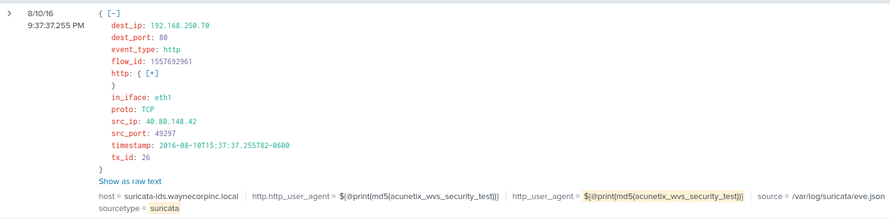

# ItsyBitsy

## Intro

During normal SOC monitoring, Analyst John observed an alert on an IDS solution indicating a potential C2 communication from a user Browne from the HR department. A suspicious file was accessed containing a malicious pattern THM:{ \_\_\_\_\_\_\_\_ }. A week-long HTTP connection logs have been pulled to investigate. Due to limited resources, only the connection logs could be pulled out and are ingested into the `connection_logs` index in Kibana.\

Our task in this room will be to examine the network connection logs of this user, find the link and the content of the file, and answer the questions.

## Lab

_How many events were returned for the month of March 2022?_

<figure><figcaption>
Kibana Discover Tab
</figcaption></figure>

**1482**

_What is the IP associated with the suspected user in the logs?_

<figure><figcaption></figcaption></figure>

**192.166.65.54**. Only 2 different source IPs were found, but the IP with thousands of logs is probably expected, and not not the C2 connection. Lets check out the 192.166.65.54 logs:

<figure><figcaption>
source_ip : 192.166.65.54
</figcaption></figure>

_The user’s machine used a legit windows binary to download a file from the C2 server. What is the name of the binary?_

<figure><figcaption></figcaption></figure>

The machine uses the [**bitsadmin**](https://learn.microsoft.com/en-us/windows-server/administration/windows-commands/bitsadmin) CLI tool

_The infected machine connected with a famous filesharing site in this period, which also acts as a C2 server used by the malware authors to communicate. What is the name of the filesharing site?_

<figure><figcaption></figcaption></figure>

[**pastebin.com**](https://pastebin.com/faq)

_What is the full URL of the C2 to which the infected host is connected?_

<figure><figcaption></figcaption></figure>

[**pastebin.com/yTg0Ah6a**](https://pastebin.com/yTg0Ah6a)

_A file was accessed on the filesharing site. What is the name of the file accessed?_

**secret.txt**

_The file contains a secret code with the format THM{\_\_\_\_\_}._

<figure><figcaption></figcaption></figure>

**THM{SECRET\_\_CODE}**

